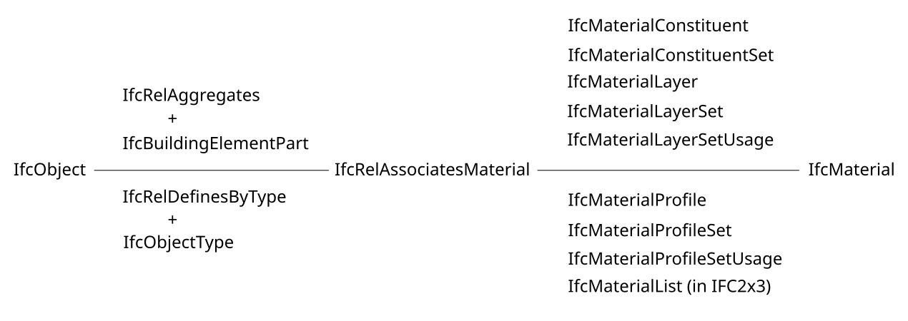

## Entities

### Required fields

`name` is mandatory.
`predefinedType` is optional.

### Entity facet interpretation

| IDS Cardinality | Entity Name | Entity Predefined Type | Configuration Allowed? | IDS Interpretation                                                                                         |
| --------------- | ----------- | ---------------------- | ------- | ---------------------------------------------------------------------------------------------------------- |
| REQUIRED        | IFCEXAMPLE  | -                      | ✅      | Applicable objects must be of entity IFCEXAMPLE.                                                           |
| REQUIRED        | IFCEXAMPLE  | EXAMPLE                | ✅      | Applicable objects must be of entity IFCEXAMPLE and predefined type EXAMPLE.                               |
| OPTIONAL        | IFCEXAMPLE  |                        | ❌      | Optionality does not make sense - no added field to require.                                               |
| OPTIONAL        | IFCEXAMPLE  | EXAMPLE                | ✅      | If applicable object is an IFCEXAMPLE entity, it must also have the EXAMPLE predefined type.               |
| PROHIBITED      | IFCEXAMPLE  |                        | ✅      | Applicable objects can not be of IFCEXAMPLE entity.                                                        |
| PROHIBITED      | IFCEXAMPLE  | EXAMPLE                | ✅      | Applicable objects can be of IFCEXAMPLE entity (or else), but not if it is of the EXAMPLE predefined type. |

### IFC Predefined Types

The logic for the identification of `predefinedType` in an IFC file:

----**IF:** [the object](https://ifc43-docs.standards.buildingsmart.org/IFC/RELEASE/IFC4x3/HTML/lexical/IfcObject.htm) is defined by [a type](https://ifc43-docs.standards.buildingsmart.org/IFC/RELEASE/IFC4x3/HTML/lexical/IfcTypeObject.htm) (look for [IfcRelDefinesByType](https://ifc43-docs.standards.buildingsmart.org/IFC/RELEASE/IFC4x3/HTML/lexical/IfcRelDefinesByType.htm) relation)

-------- **IF:** the [type object](https://ifc43-docs.standards.buildingsmart.org/IFC/RELEASE/IFC4x3/HTML/lexical/IfcTypeObject.htm) has a `PredefinedType` with a value `USERDEFINED`

------------ The value of the predefined type is in the `ElementType` attribute of that [type object](https://ifc43-docs.standards.buildingsmart.org/IFC/RELEASE/IFC4x3/HTML/lexical/IfcTypeObject.htm). ✅

-------- **ELSE IF:** the [type object](https://ifc43-docs.standards.buildingsmart.org/IFC/RELEASE/IFC4x3/HTML/lexical/IfcTypeObject.htm) has a `PredefinedType` with a value other than `USERDEFINED`

------------ The value of the predefined type is in the `PredefinedType` attribute of that [type object](https://ifc43-docs.standards.buildingsmart.org/IFC/RELEASE/IFC4x3/HTML/lexical/IfcTypeObject.htm). ✅

-------- **ELSE:** the [type object](https://ifc43-docs.standards.buildingsmart.org/IFC/RELEASE/IFC4x3/HTML/lexical/IfcTypeObject.htm) does not define the predefined type - look in the object instance. ⬇️

---- **ELSE:**

-------- **IF:** [the object](https://ifc43-docs.standards.buildingsmart.org/IFC/RELEASE/IFC4x3/HTML/lexical/IfcObject.htm) has a `PredefinedType` with a value `USERDEFINED`.

------------ The value of the predefined type is in the `ObjectType` attribute of that [object](https://ifc43-docs.standards.buildingsmart.org/IFC/RELEASE/IFC4x3/HTML/lexical/IfcObject.htm). ✅

--------**ELSE IF:** [the object](https://ifc43-docs.standards.buildingsmart.org/IFC/RELEASE/IFC4x3/HTML/lexical/IfcObject.htm) has a `PredefinedType` with a value other than `USERDEFINED`

------------ The value of the predefined type is in the `PredefinedType` attribute of that [object](https://ifc43-docs.standards.buildingsmart.org/IFC/RELEASE/IFC4x3/HTML/lexical/IfcObject.htm). ✅

-------- **ELSE:** the [object](https://ifc43-docs.standards.buildingsmart.org/IFC/RELEASE/IFC4x3/HTML/lexical/IfcObject.htm) does not have a predefined type. 🔚

**Examples:**

| IDS Entity | IDS Predefined Type | IFC Entity | IFC Predefined Type | IFC Element/Object Type | IFCxIDS Result |
| ---------- | ------------------- | ---------- | ------------------- | ----------------------- | -------------- |
| IFCWALL    | USERDEFINED         | IFCWALL    | USERDEFINED         | -                       | ✅             |
| IFCWALL    | USERDEFINED         | IFCWALL    | USERDEFINED         | FOO                     | ✅             |
| IFCWALL    | FOO                 | IFCWALL    | USERDEFINED         | FOO                     | ✅             |
| IFCWALL    | FOO                 | IFCWALL    | FOO                 | -                       | ✅             |

## Attribute

### Required fields

`name` is mandatory. `value` is optional.

### Attribute facet interpretation

| IDS Cardinality | Attribute Name | Attribute Value | Configuration Allowed? | IDS Interpretation                                                                                                            |
| --------------- | -------------- | --------------- | ---------------------- | ----------------------------------------------------------------------------------------------------------------------------- |
| REQUIRED        | Example        | -               | ✅                     | Applicable objects must have the attribute *Example* populated (i.e. not null).                                               |
| REQUIRED        | Example        | Answer          | ✅                     | The attribute *Example* must have the value *Answer* (on applicable objects).                                                 |
| OPTIONAL        | Example        | -               | ❌                     | Optionality does not make sense - no added field to require.                                                                  |
| OPTIONAL        | Example        | Answer          | ✅                     | If the attribute *Example* exists on applicable objects, it needs to have the value *Answer*.                                 |
| PROHIBITED      | Example        | -               | ✅                     | The attribute *Example* must not exist on applicable objects, even if empty.                                                  |
| PROHIBITED      | Example        | Answer          | ✅                     | The attribute *Example* must not have the value *Answer* (on applicable objects). Null is also an allowed value in this case. |

## Properties

### Required fields

Both `propertySet` and `baseName` are mandatory. Both `dataType*` and `value` are optional, but if `value` is provided, it requires also `dataType*`. Optional attribute `uri` is only a metadata, not subject to IDS checking.

### Property facet interpretation

| IDS Cardinality | Property Set | Base Name | Data Type | Value | Configuration Allowed? | IDS Interpretation                                                                                                                    |
| --------------- | ------------ | --------- | --------- | ----- | ---------------------- | ------------------------------------------------------------------------------------------------------------------------------------- |
| REQUIRED        | My_Set       | My_Prop   | -         | -     | ✅                     | Applicable objects need to have the property *My_Prop* in the *My_Set*.                                                               |
| REQUIRED        | My_Set       | My_Prop   | IFCTEXT   | -     | ✅                     | (as above) + of data type *IFCTEXT*.                                                                                                  |
| REQUIRED        | My_Set       | My_Prop   | IFCTEXT   | Test  | ✅                     | (as above) + of value *Test*.                                                                                                         |
| REQUIRED        | My_Set       | My_Prop   | -         | Test  | ❌                     | Not allowed. If value is specified, it requires specification of a data type.                                                         |
| OPTIONAL        | My_Set       | My_Prop   | -         | -     | ❌                     | Optionality does not make sense - no added field to require.                                                                          |
| OPTIONAL        | My_Set       | My_Prop   | IFCTEXT   | -     | ✅                     | If applicable object have the property *My_Prop* in *My_Set* set, it needs to be an *IFCTEXT* data type. Lack of property is allowed. |
| OPTIONAL        | My_Set       | My_Prop   | IFCTEXT   | Test  | ✅                     | (as above) + have the value equal *Test*. Lack of property is allowed.                                                                |
| OPTIONAL        | My_Set       | My_Prop   | -         | Test  | ❌                     | Not allowed. If value is specified, it requires specification of a data type.                                                         |
| PROHIBITED      | My_Set       | My_Prop   | -         | -     | ✅                     | The property *My_Prop* must not exist, regardless of the value, even if empty.                                                        |
| PROHIBITED      | My_Set       | My_Prop   | IFCTEXT   | -     | ❌                     | Not allowed. Either prohibit whole property or specify values with REQUIRED/OPTIONAL.                                                 |
| PROHIBITED      | My_Set       | My_Prop   | IFCTEXT   | Test  | ❌                     | Not allowed. Either prohibit whole property or specify values with REQUIRED/OPTIONAL.                                                 |
| PROHIBITED      | My_Set       | My_Prop   | -         | Test  | ❌                     | Not allowed. If value is specified, it requires specification of a data type.                                                         |

<!-- For an evaluation of the rationale, see [these minutes](https://github.com/buildingSMART/IDS/issues/206#issuecomment-1820696088). -->

## Classification

### Required fields

The `system` field is mandatory, the `value` is optional. Optional attribute `uri` is only a metadata, not subject to IDS checking.

### Classification facet interpretation

| IDS Cardinality | Classification System | Classification Value | Configuration Allowed? | IDS Interpretation                                                                                                            |
| --------------- | --------------------- | -------------------- | ---------------------- | ----------------------------------------------------------------------------------------------------------------------------- |
| REQUIRED        | Example               | -                    | ✅                     | Applicable objects must have the classification system *Example* populated (i.e. not null).                                               |
| REQUIRED        | Example               | Code                 | ✅                     | The classification *Example* must have the value *Code* (on applicable objects).                                                 |
| OPTIONAL        | Example               | -                    | ❌                     | Not allowed. Optionality does not make sense - no added field to require.                                                                  |
| OPTIONAL        | Example               | Code                 | ✅                     | If the classification *Example* exists on applicable objects, it needs to have the value *Code*.                                 |
| PROHIBITED      | Example               | -                    | ✅                     | The classification *Example* must not exist on applicable objects, even if empty.                                                  |
| PROHIBITED      | Example               | Code                 | ✅                     | The classification *Example* must not have the value *Code* (on applicable objects). Null is also an allowed value in this case. |

## Material

The `value` field is optional. Optional attribute `uri` is only a metadata, not subject to IDS checking.

| IDS Cardinality | Material Value | Configuration Allowed? | IDS Interpretation                                                                               |
| --------------- | -------------- | ---------------------- | ------------------------------------------------------------------------------------------------ |
| REQUIRED        | -              | ✅                     | Applicable objects must have at least one related material, no matter its name.                                      |
| REQUIRED        | Steel          | ✅                     | Applicable objects must have the material *Steel* related. More materials are allowed.     |
| OPTIONAL        | -              | ❌                     | Not allowed. No added value in specifying that it can have material or not.                      |
| OPTIONAL        | Steel          | ✅                     | Applicable objects don't need to have any materials, but if they do, *Steel* must be among them. |
| PROHIBITED      | -              | ✅                     | Applicable objects must not have any materials associated.                                       |
| PROHIBITED      | Steel          | ✅                     | *Steel* must not be among the materials associated with applicable objects.                      |

### IFC Material Relations

In IFC (4x3 and before) materials ([IfcMaterial](https://ifc43-docs.standards.buildingsmart.org/IFC/RELEASE/IFC4x3/HTML/lexical/IfcMaterial.htm)), can be associated to objects ([IfcObject](https://ifc43-docs.standards.buildingsmart.org/IFC/RELEASE/IFC4x3/HTML/lexical/IfcObject.htm)) through [IfcRelAssociatesMaterial](https://ifc43-docs.standards.buildingsmart.org/IFC/RELEASE/IFC4x3/HTML/lexical/IfcRelAssociatesMaterial.htm) relation. 

However, the relation is not always direct. Sometimes objects are defined by a type or are parts aggregated in a larger assembly. Also, there are multiple ways to associate material with an object, for example, through a set of layers or as a list of constituents. 

⚠️TODO: in the documentation we will be explicit that traversing IfcRelDecomposition for the purpose of material evaluation will not be implemented in 1.0. We need to define what is the behaviour when it comes to the IfcRelDecomposition and the propagation of materials.

## PartOf

| Fields Entered        | Required | Optional | Prohibited | Applicability |
| --------------------- | -------- | -------- | ---------- | ------------- |
| `entity`              | ✅       | ❌       | ✅         | ✅            |
| `entity`, `relation*` | ✅       | ❌       | ✅         | ✅            |

REQUIRED:

- Entity: A relation is needed to the type of entity required (traversing all valid relationships)
- Entity/Relation: A relation is needed to the type of entity required (traversing only the defined relationship type)

OPTIONAL:

- IDS Entity: IfcWall: If the element has a matching relationship the target should match the Entity.
  - IFC ENtity has a relation, it must be to a wall (but the relation is optional)
  - IFC Opening in a slab -> fail (no relation to the of the entity encounters a wall)
  - Ifc opening in a wall -> pass

PROHIBITED:

- Entity: A relation cannot exist with needed to the type of entity required (traversing all valid relationships)
- Entity/Relation: A relation cannot exist to the type of entity required (traversing only the defined relationship type)

APPLICABILITY:

- Entity: A relation exists to the type of entity required (traversing all valid relationships)
- Entity/Relation: A relation exists to the type of entity required (traversing only the defined relationship type)

___
\* the field is an XML attribute