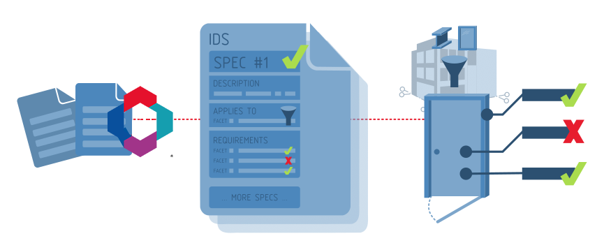

# How do specifications work?

A **Specification** is designed to be easy for humans to understand. However, **Specifications** are also highly structured so that computer software may automatically and accurately check information requirements with no ambiguity. Every **Specification** has three parts:

 1. **Description**: a description of why the **Specification** is important to your project and instructions of how to achieve it. This part is designed for humans to read and understand why information is being requested.
 2. **Applicability**: which type of objects the **Specification** applies to. There are many different types of objects in IFC models, such as walls, doors, and windows, but each **Specification** will only apply to certain objects.
 3. **Requirements**: what information is required for the objects specified in part 2, such as required properties or classifications.

For example, the **Specification** of "_all walls must have a fire rating property_" is structured like so:

 1. **Description**: wall fire ratings are critical for building code compliance
 2. **Applicability**: this specification applies to all wall objects
 3. **Requirements**: the aforementioned wall objects must have a fire rating property

## How specifications can describe information

**Applicability** and **Requirements** are described using **Facets**. A **Facet** describes information that a single entity (e.g. wall, door, etc) in your model may have. A **Facet** describes its information precisely using fixed **Facet Parameters** so that computers can understand exactly what information you are after.

When a **Facet** is used in the **Applicability** section, the **Facet** describes information that an entity needs to have for the **Specification** to be **Applicable** to the entity.

When a **Facet** is used in the **Requirements** section, the **Facet** describes information that an entity needs to have to comply with the **Specification**.

There are five different **Facets** of information:

Facet Type | Facet Parameters | Example applicability | Example requirement
--- | --- | --- | ---
**Entity** | **IFC Class** and **Predefined Type** | Applies to "IfcWall" with predefined type of "SHEAR" | Must be an "IfcWall" with a predefined type of "SHEAR"
**Attribute** | **Name** and **Value** | Applies to elements with the attribute "Name" having the value "W01" | Must have the attribute "Name" with the value "W01"
**Classification** | **System** and **Value** | Applies to elements classified under "Uniclass 2015" as "EF_25_10_25" | Must have a "Uniclass 2015" classification reference of "EF_25_10_25"
**Property** | **Property Set**, **Name**, and **Value** | Applies to elements with a property set of "Pset_WallCommon" with a "LoadBearing" property set to "TRUE" | Must have a "Pset_WallCommon" property set with a "LoadBearing" property set to "TRUE"
**Material** | **Value** | Applies to "concrete" elements | Must have a "concrete" material
**Parts** | **Entity** and **Relationship** | Applies to elements that are "contained in" an "IfcSpace" | Must be "contained in" an "IfcSpace"

You can combine multiple **Facets** together in either the **Applicability** or **Requirements** section to describe a wide variety of **Specifications**. Some **Facets** may have optional **Facet Parameters**. For example, if you want to specify that a property should exist, but not the exact value, you may omit the value parameter of the **Property Facet**.

You may also specify a list of valid values, or a range of numbers, or text pattern for some **Facet Parameters**. These are known as **Complex Restrictions**. For example, you would use a **Complex Restriction** to specify that a fire rating property must choose from either the value "0HR", "1HR", or "2HR" only.

Here are a few examples to whet your appetite:

Description | Applicability | Requirements
--- | --- | ---
External load bearing walls need to have a fire rating property for code compliance | <ul><li>**Entity Facet** (**IFC Class** is IfcWall)</li><li>**Property Facet** (**Property Set** is Pset_WallCommon, **Name** is LoadBearing, **Value** is TRUE)</li></ul> | <ul><li>**Property Facet** (**Property Set** is Pset_WallCommon, **Name** is FireRating)</li></ul>
Bedrooms should have a minimum area of 10m2 | <ul><li>**Entity Facet** (**IFC Class** is IfcSpace)</li><li>**Attribute Facet** (**Description** must contain the text "BEDROOM")</li></ul> | <ul><li>**Property Facet** (**Property Set** is Qto_SpaceBaseQuantities, **Name** is NetFloorArea, **Value** is >= 10)</li></ul>
All brick wall types must be classified and follow the approved naming convention | <ul><li>**Entity Facet** (**IFC Class** is IfcWallType)</li><li>**Material Facet** (**Value** is brick)</li></ul> | <ul><li>**Classification Facet** (**System** is Uniclass 2015, **Value** must start with EF_25_10)</li><li>**Attribute Facet** (**Name** is Name, **Value** must be the letters "WT" followed by 2 numbers, such as WT01, WT02, etc)</li></ul>

To see the full capabilities of what each information each **Facet** can specify, see the sections below for more detail.

## Required and optional specifications

Each **Specification** may also specify whether it is **Required**, **Optional**, or **Prohibited**. Given the example **Specification** of "_all walls must have a fire rating property_" this is the interpretation:

Type | Meaning | Example
--- | --- | ---
**Required** | The specified information _must_ be found in the IFC model | The model must have walls, and they must all have a fire rating property
**Optional** | If there are elements in the IFC model that are applicable to the **Specification**, then the **Requirements** must be satisfied | The model may or may not have walls. If they do, then they must have a fire rating property
**Prohibited** | The specified information _must not_ be found in the IFC model | The model should not have any walls that have a fire rating property. Walls without a fire rating property are allowed. Other non-wall elements with a fire rating property are also allowed.

## IFC schema support

Each **Specification** may specify the IFC schema(s) that it applies to. If a model does not match the schema(s), the **Specification** will not apply and will not be audited. The supported IFC schemas are:

 - IFC4X3
 - IFC4
 - IFC2X3

IDS assumes that the provided IFC model only contains valid data. If the model has syntax errors or IFC schema validation errors, then the model may not be able to be audited. It is the responsibility of the IFC authoring software to ensure that the produced IFCs are valid.

## Advanced information requirements

The first version of IDS targets basic information and relationships in IFC that are common to all disciplines. More advanced information requirements are currently out of scope for IDS. For example, geometry checks, checks that rely on calculated or dynamic values, checks that reference data outside the IFC model, or use domain specific IFC relationships are not possible. Here are some types of advanced requirements that you will need other tools to help audit:

 - There must be no clashes between structural beams and pipes
 - All walls need to be 3m away from the site boundary
 - The total area of all office spaces must be more than 300m2
 - The names of all door types must be unique
 - All pumps need to have a nominated supplier and manufacturer
 - All air handling units must have sensors assigned with trigger events
 - Saturday and sunday must be a holiday in all work schedules
 - All models shall load in under 3 minutes by major software vendors
 - Associated drawings in the model must match the latest revisions in the CDE
 - All rebar should be modeled as parametric swept disks
 - The model must match the as-built state of construction
